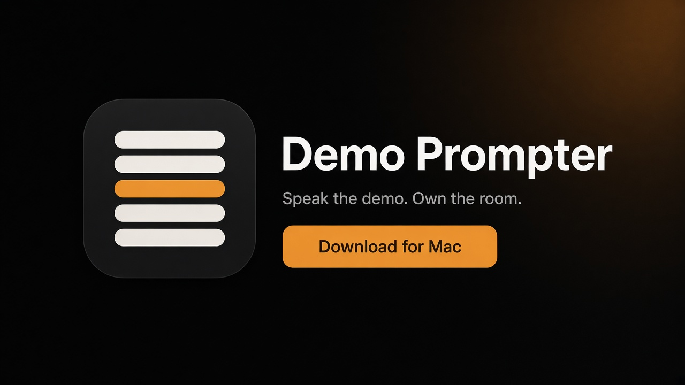

# Demo Prompter

Marketing site for **Demo Prompter**, branded with the Clear Cue system.

Tagline: Speak the demo. Own the room.



## Local run

```bash
npm install
cp .env.example .env.local
npm run dev
```

Open [http://localhost:3000](http://localhost:3000).

Scripts: `dev`, `build`, `start`, `lint`.

## Download button

The Mac download control asks GitHub for the latest release of
[`mrlynn/cursor-demo-teleprompter`](https://github.com/mrlynn/cursor-demo-teleprompter)
and looks for a `.dmg` (prefers a name containing `demoprompter`).

That repository may be private. A 404, a network error, or a release with no
DMG renders a finished **Coming soon** state. It is not a broken button.

Override the GitHub lookup when you host a public file:

```bash
NEXT_PUBLIC_DMG_URL=https://example.com/demoprompter-1.2.3.dmg
NEXT_PUBLIC_RELEASE_VERSION=v1.2.3
```

Set these in `.env.local` or in the Vercel project settings. Do not commit secrets.

## Deploy on Vercel

1. Import `mrlynn/demoprompter-site`.
2. Framework preset: Next.js. Build command: `npm run build`. Output: default.
3. Optional env: `NEXT_PUBLIC_SITE_URL`, `NEXT_PUBLIC_DMG_URL`, `NEXT_PUBLIC_RELEASE_VERSION`.
4. `NEXT_PUBLIC_SITE_URL` should be the production origin so Open Graph URLs resolve.

## Brand kit

Clear Cue tokens and marks live in `public/brand/`:

- `app-icon-1024.png`
- `site-hero.png`
- `lockup-dark.png`
- `mark-on-dark.png`
- `mark.svg`
- `dmg-backdrop.png`

Palette: ink `#14161A`, slate `#2A2E36`, steel `#3E5C76`, fog `#8B919A`,
mist `#C8CCD2`, bone `#F4F1EA`, paper `#FFFFFF`, cue `#E8913A`,
cue_soft `#F0B36A`, sage `#4A9B7F`, warn `#C45C4A`.
